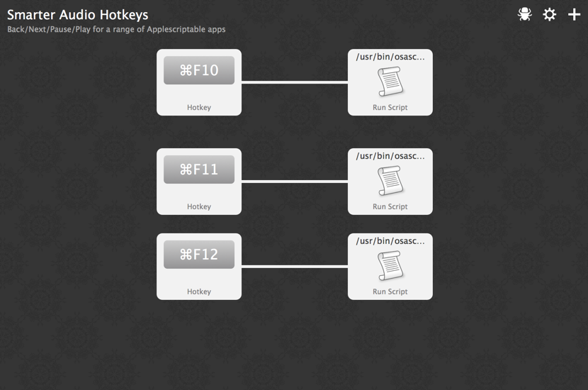

# Smarter Audio Hotkeys for Alfred

Adds play, pause, back and forward hotkeys that support a range of applications.
The current audio source will be controlled by

* F10 - go to start of current track/previous track
* F11 - pause current audio source / play last audio source
* F12 - go to start of next track

Note that the play action only works if the last application was stopped with
F11. If it an audio source can't be detected we'll default to controlling
iTunes.

## Supported Applications
*  iTunes
*  Instacast
*  Quicktime Player
*  Spotify

## Todo
* Visual feedback for non-iTunes apps
* Support for more applications

## License

MIT © [Gavin Montague](http://leftbrained.co.uk)
